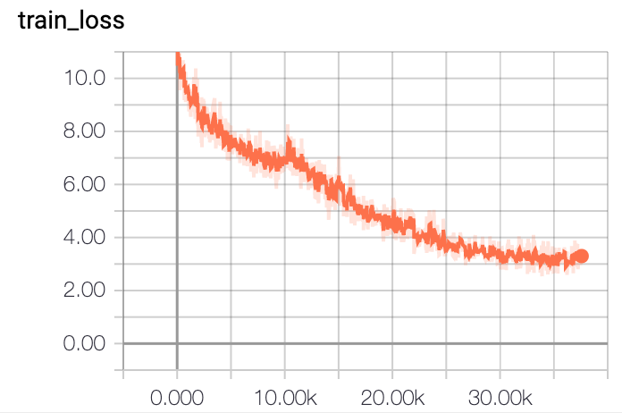
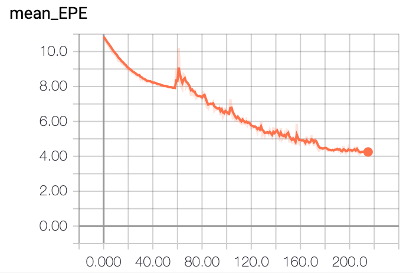
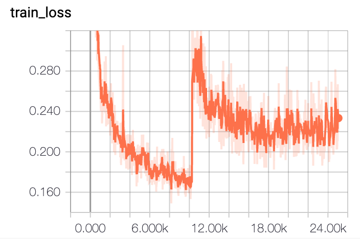
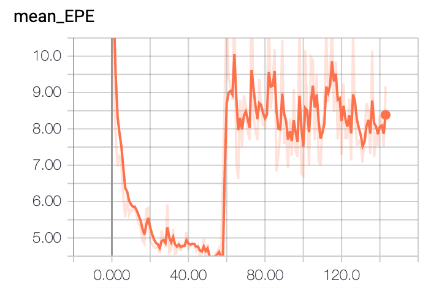
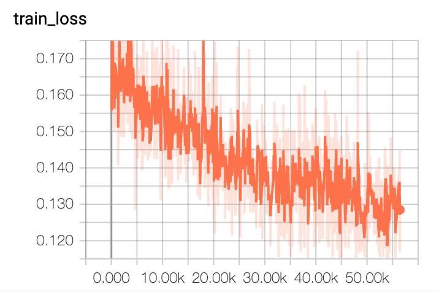
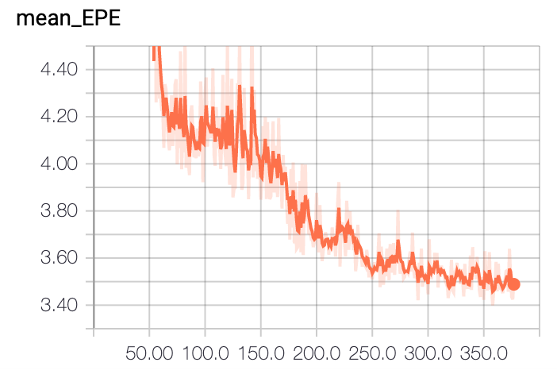
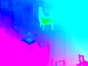
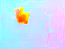
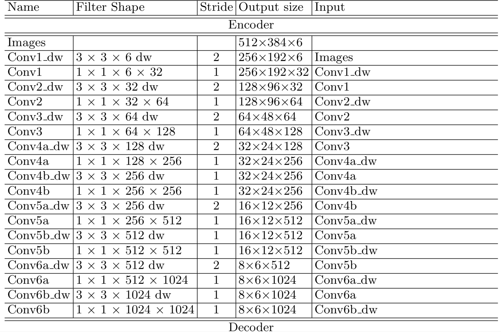
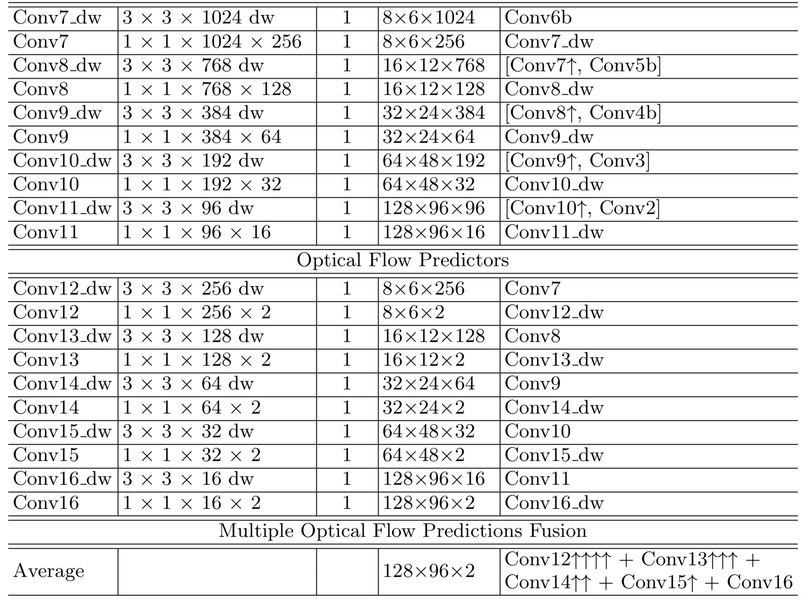

# LightFlow - Pytorch
Pytorch implementation of **Light Flow**, a light weight version of [FlowNet](https://arxiv.org/pdf/1504.06852.pdf), which is introduced in [Towards High Performance Video Object Detection for Mobiles](https://arxiv.org/pdf/1804.05830.pdf) by Xizhou Zhu, Jifeng Dai, Xingchi Zhu, Yichen Wei and Lu Yuan. It significantly speeds up the FlowNet by ***65x*** theoretically, while only causes minor drop in accuracy.

The code is inspired from [FlowNetPytorch](https://github.com/ClementPinard/FlowNetPytorch), major differences include:

### Model
Replace convolutions with **3x3 depthwise separable** convolutions. Replace transposed convolutions with **nearest-neighbor upsampling** to address checkerboard artifacts.   

Unlike FlowNet that uses multiple optical flow predictors for training and a finest predictor for inferencing, Light Flow aggregates those multi-resolution predictions into a finest one for both training and testing. See [Model Structure](#model-structure) for details.

### Learning rate policy
403 epochs are performed on 2 GPUs (1080Ti) with each one holds 64 image pairs. Tested against learning rate 1e-2 along with epoch 59 - 173 following the paper, the validation EPE was abnormaly raised up to a high value ~8.5 and jiggling there around as training goes on, thus switch it back to half of the initial learning rate instead. See [Experiment on Flying Chairs](#experiment-on-flying-chairs) for details.

| Epoch       | Learning Rate |
| ----------- | ------------- |
| 0 - 57      | 1e-3          |
| 58 - 173    | 5e-4          |
| 174 - 231   | 2.5e-4        |
| 232 - 288   | 1.25e-4       |
| 289 - 346   | 6.25e-5       |
| 347 - 402   | 3.125e-5      |

### Loss
[FlowNetPytorch](https://github.com/ClementPinard/FlowNetPytorch) applies multiscale loss with 5 predefined weights for each ***L2*** distance between multi-resolution predictions and the respect ground thruth flow. Here a single ***L1*** loss is used for Light Flow instead.


## Prerequisite
```
python3
pytorch >= 1.0.1
tensorboard-pytorch
tensorboardX >= 1.4
imageio
argparse
```


## Experiment on Flying Chairs
**Flying Chairs Dataset: [download](http://lmb.informatik.uni-freiburg.de/resources/datasets/FlyingChairs.en.html)**

```bash
# Train the model from scratch
python main.py
```
```bash
# Checkout the training and testing progress
tensorboard --logdir=/path/to/checkoints
```

### config-1
* batch size: 64 pairs on each gpu
* optimizer: Adam
* momentum: 0.9
* beta: 0.999
* weight decay: 4e-5
* bias decay: 0.
* start epoch: 0
* **div flow: 1.**
* lr: 0.001 for 1st 58 epochs, 0.01 for 2nd 116 epochs and divided by 2 for ever 58 epochs.

With div_flow set to 1., there is a smooth training progress but poor performance, the best EPE is about **4.2** which is not desirable.

<br />



### config-2
* batch size: 64 pairs on each gpu
* optimizer: Adam
* momentum: 0.9
* beta: 0.999
* weight decay: 4e-5
* bias decay: 0.
* start epoch: 0
* **div flow: 20.**
* lr: 0.001 for 1st 58 epochs, 0.01 for 2nd 116 epochs and divided by 2 for ever 58 epochs.

Set div_flow to 20., training appears to be unstable compare to div_flow 1. From the curves, the 1st 58 epochs are well performed, and gets totally lost while switching learning rate 10 times at epoch 59.

<br />



### config-3
* batch size: 64 pairs on each gpu
* optimizer: Adam
* momentum: 0.9
* beta: 0.999
* weight decay: 4e-5
* bias decay: 0.
* **start epoch: 58**
* **div flow: 20.**
* lr: 0.001 for 1st 58 epochs, **5e-4** for 2nd 116 epochs and divided by 2 for ever 58 epochs.

Starting from the model above at epoch 58, I change the learning rate to 5e-4 instead of 0.01, the final EPE gets much better (~3.45) but still cannot match the result from the paper. Suggesions on some other lr policies or loss functions are appreciated.

<br />



## Results

| flow network                  | EPE  |
| ----------------------------- | ---- |
| 1.0  Light Flow ***(ours)***  | 3.45 |
| 1.0  Light Flow (paper)       | 3.14 |
| 0.75 Light Flow (paper)       | 3.63 |
| 0.5  Light Flow (paper)       | 4.44 |

<br />
<br />


You can download the trained model from `flying_chairs` folder. If you find some miss configurations or wrong implementations, please feel free to shoot me an issue.

## Model Structure
<br />


## License
[MIT](./LICENSE)